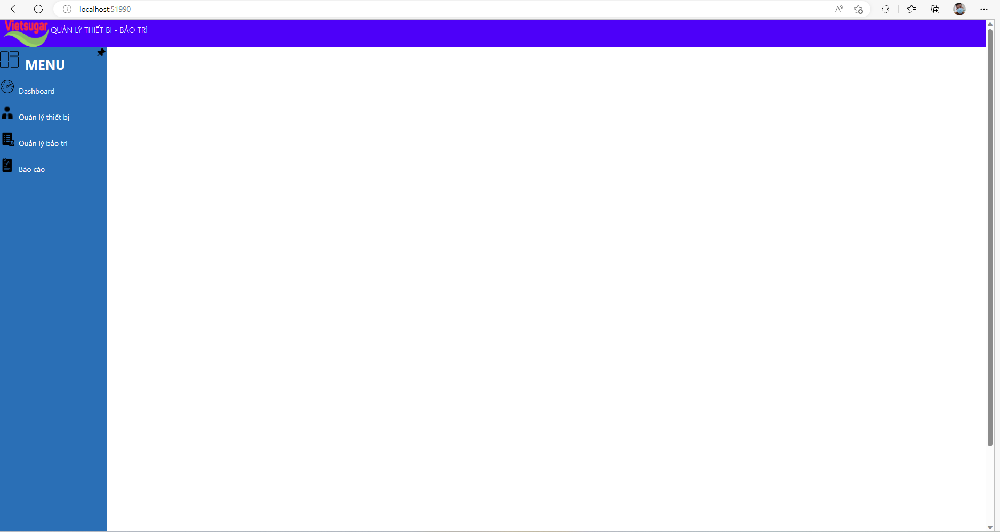

# Webform Tree Data

## Develop tools

Visual Studio 2013 Ultimate

Visual Studio Code

IIS Express

SQL Server 2012 Express

## Languages
C#, HTML, CSS, Javascript

## I'm work with

Javascript:

document.getElementById("")

document.getElementsByTagName("")

document.getElementsByClassName("")

AJAX with javascript:
const xhttp = new XMLHttpRequest();

xhttp.onload = function(){

    document.getElementById("id_name").innerHTML = this.responseText;

}

xhttp.open("GET", "localhost:51990/Resources/AJAX/ThemThietBi.aspx&id=" + 
id);

xhttp.send();

FormView

Insert

Edit

SqlDataReader

SqlCommand, ExecuteNonQuery